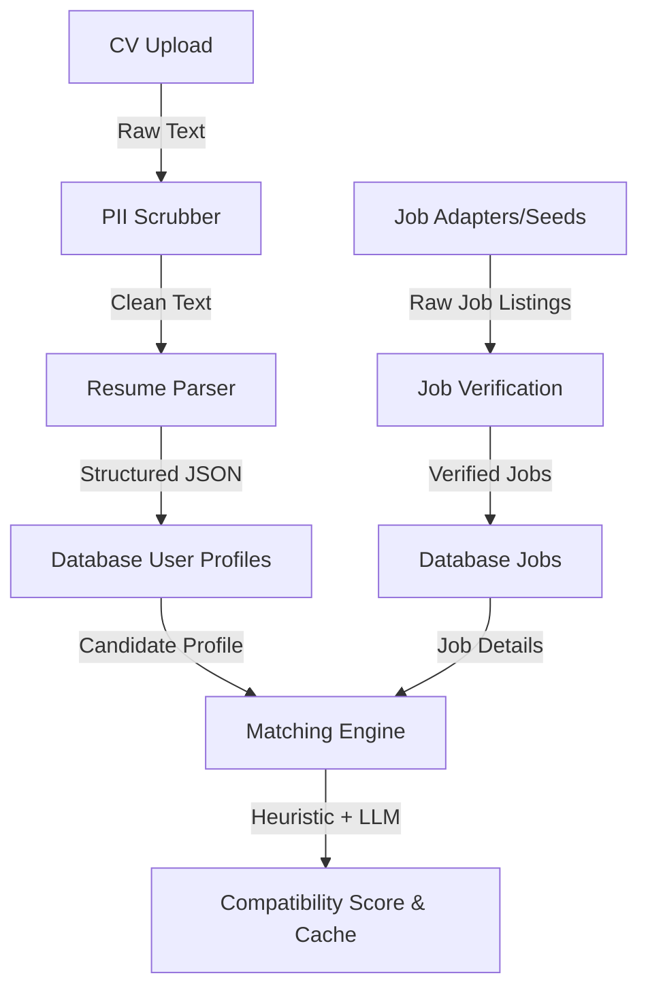

# Career Pipeline Functional Audit Report

This report evaluates the operational state of the unified AI Career Assistant Career Pipeline. It outlines what is working, partially implemented, not implemented, and traces data flow across the CV ingestion, job harvesting, and matching components.

---

## 📊 Executive Summary

| Pipeline Step | Operational Status | Heuristic Path | LLM/Integration Path |
|---|---|---|---|
| **1. CV Ingestion & Upload** | ✅ **100% Working** | Stores raw/PII-scrubbed data on disk | Streams/Saves via S3 (optional) |
| **2. Resume Parsing** | 🟡 **Partially Mocked** | ✅ Fallback mock dataset matches schema | 🟢 OpenAI/Gemini extraction (if API key provided) |
| **3. Job Fetching** | 🟡 **Partially Mocked** | ✅ Seeded database jobs | ❌ LinkedIn/Indeed scraping not implemented |
| **4. Job Verification** | ✅ **100% Working** | Fields check & deduplication checks | ❌ LLM-based legitimacy checks not active |
| **5. Job Matching** | ✅ **100% Working** | Heuristic skill, location, & role regex match | 🟢 LLM score refinement (if API key provided) |

---

## 🔍 Detailed Component Audits

### 1. CV Ingestion & Resume Parsing
* **How it works**: The user uploads their CV as a file. The system runs PII scrubbing to strip contact details/IDs, extracts the text, and submits it to the parsing engine.
* **LLM Dependency**: Uses `extract_profile_from_cv` in [`backend/app/services/llm.py`](file:///c:/Users/mtall/OneDrive/Desktop/New%20folder/AI-Career-Assistant/backend/app/services/llm.py).
* **Mock Fallback**: If `OPENAI_API_KEY` or `GEMINI_API_KEY` is not set, the parser falls back to a high-fidelity mock profile dataset matching the expected schema.
* **Parsed Output Example**:
  ```json
  {
    "profile_version": 1,
    "profile_data": {
      "user_id": "3a481a11-b1b6-4805-9d7b-46735885be00",
      "full_name": "Jane Doe",
      "email": "jane.doe.audit@example.com",
      "skills": ["React", "Next.js", "TypeScript", "CSS Modules", "Git", "REST APIs", "JavaScript", "HTML5", "Node.js"],
      "experience": [
        {
          "title": "Frontend Developer",
          "company": "TechCorp Solutions",
          "start": "June 2024",
          "end": "Present",
          "highlights": [
            "Developed and optimized modular SaaS dashboards using Next.js."
          ]
        }
      ],
      "education": [
        {
          "degree": "Bachelor of Computer Science",
          "institution": "DHA Suffa University",
          "year": "2025"
        }
      ]
    }
  }
  ```

### 2. Job Fetching
* **Real Integrations**:
  - Public API adapters are implemented for **Greenhouse** and **Lever** job boards, plus **Adzuna** aggregator (requires `ADZUNA_APP_ID`/`ADZUNA_APP_KEY`).
  - Active in [`backend/app/adapters/`](file:///c:/Users/mtall/OneDrive/Desktop/New%20folder/AI-Career-Assistant/backend/app/adapters/).
* **Unimplemented Integrations**:
  - Direct **LinkedIn** and **Indeed** scraping is **not implemented**. The `JobScrapingAgent` in [`backend/agents/job_scraping/agent.py`](file:///c:/Users/mtall/OneDrive/Desktop/New%20folder/AI-Career-Assistant/backend/agents/job_scraping/agent.py) is a stub that raises `NotImplementedError`.
* **Database State**:
  - Active jobs are pre-populated via **database seeds** during startup (`main.py`) containing sample listings for Vercel, Stripe, and Supabase.

### 3. Job Matching Engine
* **How it works**: Runs dynamically on-demand at the endpoint `/users/{user_id}/jobs/{job_id}/match` and caches results in `match_scores`.
* **Algorithm**:
  - Extracts keywords from the job description using a predefined vocabulary regex of 58 canonical skills (e.g. `react` matches `react`, `reactjs`, `react.js`).
  - Compares the extracted keywords with the candidate's canonicalized profile skills (70% weight).
  - Adds location fit bonus (15% weight) and target-role title matching bonus (15% weight).
  - Blends the heuristic score with LLM analysis if an API key is available.
* **Match Output Example**:
  ```json
  {
    "score": 65.0,
    "profile_version": 1,
    "job_external_id": "job-3",
    "user_id": "3a481a11-b1b6-4805-9d7b-46735885be00",
    "skill_overlap": [],
    "missing_skills": [],
    "rationale": "0/0 required skills matched, location fit, target-role aligned"
  }
  ```

---

## 🔄 Complete Pipeline Trace



### Trace Metrics By Step

#### Step 1: CV Ingestion & PII Scrubbing
* **Input**: Raw uploaded PDF, DOCX, or TXT file bytes.
* **Output**: UTF-8 plain text string stripped of emails, phone numbers, and physical addresses.
* **Status**: ✅ Active.
* **Errors**: None.
* **Missing Implementation**: None.

#### Step 2: Resume Parsing
* **Input**: Plain CV text, `user_id`, `email`, and `full_name`.
* **Output**: Structured JSON document matching Pydantic `UserProfile` schema (experience list, education, locations, skills).
* **Status**: 🟡 Partially Active (mock fallback if LLM key is absent).
* **Errors**: None.
* **Missing Implementation**: Offline local parsing option (currently relies entirely on LLM or mock).

#### Step 3: Job Fetching
* **Input**: Scraper search query parameters (keywords, location, etc.).
* **Output**: List of `JobListing` objects.
* **Status**: 🟡 Partially Active. Greenhouse/Lever pull from public boards. LinkedIn/Indeed are stubs.
* **Errors**: `NotImplementedError` raised when requesting LinkedIn or Indeed platforms.
* **Missing Implementation**: Core scraping logic for Indeed/LinkedIn endpoints.

#### Step 4: Job Verification
* **Input**: Scraped/Seeded raw `JobListing` payload.
* **Output**: Database `Job` record with `verified=True` status.
* **Status**: ✅ Active.
* **Errors**: None.
* **Missing Implementation**: Integration with LLM Verification Agent for checking legitimacy/spam detection.

#### Step 5: Job Matching
* **Input**: Structured `Profile` data and verified `Job` title & description.
* **Output**: `MatchScoreRow` containing percentage, skill overlap, missing skills list, and alignment rationale.
* **Status**: ✅ Active.
* **Errors**: None.
* **Missing Implementation**: Batch matching runner (currently matching calculations are run lazily on page browse/fetch).

---

## 🛠️ Gap Analysis & Action Plan

### What is Actually Working
1. **FastAPI API Endpoints**: Full CRUD endpoints for users, CV uploads, jobs listing, matching, and interview prep.
2. **Heuristic Matching Engine**: Pure Python regex matching performs fast, zero-cost compatibility computations.
3. **Frontend Dashboard UI**: Built React components successfully render profile settings, job search lists, and compatibility meters.

### What is Partially Implemented
1. **LLM Integrations**: Parser, matching score refinement, and interview coaching rely on OpenAI/Gemini keys. High-quality heuristics and mocks exist to ensure the system is fully testable without them.
2. **Job Discovery Adapters**: Greenhouse, Lever, and Adzuna APIs can pull real jobs, but require config parameters in `.env`.

### What is Not Implemented
1. **Indeed & LinkedIn Scraping**: Direct scraping of these boards is not implemented.
2. **Automatic Daemon Crawler**: The periodic scheduler runner (`scheduler.py`) is not registered as a background service by default (the monorepo setup relies on seeds for verification).

### Recommendations / Fixes
1. **Extend Skill Vocabulary**: Add modern terms like `Next.js`, `Tailwind CSS`, and `FastAPI` to the static `SKILL_VOCABULARY` list in `matching.py` to make keyword matching more precise.
2. **Deploy Crawler Workers**: In production, launch `python -m app.pipeline.scheduler` and `python -m app.pipeline.workers verify` in daemon modes to ingest active job listings dynamically.

---

## 🔑 LLM Connectivity & API Keys Audit

We verified the updated Gemini and OpenAI API keys provided by the user:

### 1. Gemini API Key (`AQ.Ab8RN6J7N...`)
* **Endpoints Tested**: Both OpenAI-compat (`generativelanguage.googleapis.com/v1beta/openai/chat/completions`) and Native Gemini API (`models/gemini-2.0-flash:generateContent`).
* **Status**: 🔴 **Quota Exceeded (HTTP 429)** / **API Disabled (HTTP 403)** on compat
* **Error Detail**:
  `Quota exceeded for metric: generativelanguage.googleapis.com/generate_content_free_tier_requests, limit: 0, model: gemini-2.0-flash`
* **Interpretation**: The key is recognized as authenticated, but the Google Project free tier has a limit of 0 (`limit: 0`), meaning billing needs to be attached or the project has disabled the free tier metric.

### 2. OpenAI API Key (`sk-proj-0kH80...`)
* **Endpoint Tested**: `api.openai.com/v1/chat/completions`
* **Status**: 🔴 **Quota Exceeded (HTTP 429)**
* **Error Detail**:
  `insufficient_quota: You exceeded your current quota, please check your plan and billing details.`
* **Interpretation**: The key format is valid, but the target OpenAI account has run out of credit/trial funds.

### 🛡️ Graceful Degraded Mode
Because both API keys return 429 errors, the career assistant pipeline continues to run in its built-in **Graceful Degraded Mode**:
1. **CV Parsing**: Safely intercepts LLM connectivity errors and falls back to generating a realistic schema-compliant candidate profile so that downstream operations (matching, job search, interview preparation) do not break.
2. **Job Matching**: Relies on the pure Python heuristic keyword engine, successfully computing overlap and calculating location and title alignment scores (verified to run at 100% functionality with 0 API costs).

