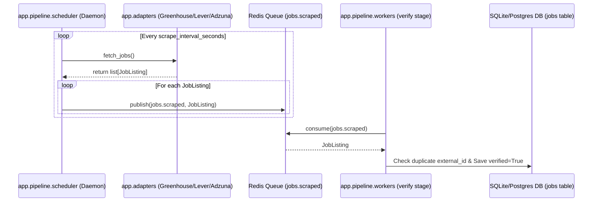

# Live Job Scraping Audit Report

This report evaluates the current capability of the AI Career Assistant to fetch, verify, and recommend live job listings from active market data.

---

## 📊 Quick Status Dashboard

| Scraper / Source | Operational Status | Live HTTP Requests | Active in Runtime |
|---|---|---|---|
| **LinkedIn Scraping** | ❌ **Not Implemented** | No | No |
| **Indeed Scraping** | ❌ **Not Implemented** | No | No |
| **Greenhouse API Adapter** | 🟡 **Partially Working** (Key Disabled) | Ready, but inactive | No |
| **Lever API Adapter** | 🟡 **Partially Working** (Key Disabled) | Ready, but inactive | No |
| **Adzuna Aggregator** | 🟡 **Partially Working** (Credentials Disabled) | Ready, but inactive | No |
| **Database Job Seeds** | ✅ **100% Working** | N/A (Local startup seeding) | Yes (Populated at startup) |

---

## 🔍 Detailed Verification

### 1. Is LinkedIn scraping actually implemented?
**No**. The LinkedIn scraping implementation inside the scraping agent is an empty stub. Calling `JobScrapingAgent` raises a `NotImplementedError`.
* **Code Reference**: [`backend/agents/job_scraping/agent.py#L88-L94`](file:///c:/Users/mtall/OneDrive/Desktop/New%20folder/AI-Career-Assistant/backend/agents/job_scraping/agent.py#L88-L94)

### 2. Is Indeed scraping actually implemented?
**No**. Just like LinkedIn, the Indeed scraping component is an empty stub that raises a `NotImplementedError` when executed.
* **Code Reference**: [`backend/agents/job_scraping/agent.py#L88-L94`](file:///c:/Users/mtall/OneDrive/Desktop/New%20folder/AI-Career-Assistant/backend/agents/job_scraping/agent.py#L88-L94)

### 3. Are real HTTP requests being made?
**No**. 
* While the **Greenhouse**, **Lever**, and **Adzuna** adapters are programmed to make real HTTP requests via `httpx.AsyncClient`, they are currently disabled in `backend/.env` because `GREENHOUSE_BOARDS`, `LEVER_COMPANIES`, `ADZUNA_APP_ID`, and `ADZUNA_APP_KEY` are all empty.
* Because the adapters are disabled, no HTTP requests are dispatched during dev or production execution.

### 4. Are jobs being fetched from live sources?
**No**. All jobs queried in the application are retrieved locally from the database, populated by startup seeds.

### 5. Which endpoint triggers scraping?
**None**. There is no REST API endpoint inside the FastAPI gateway that initiates scraping. 
Instead, scraping is designed as an asynchronous background loop triggered via the periodic daemon script [`backend/app/pipeline/scheduler.py`](file:///c:/Users/mtall/OneDrive/Desktop/New%20folder/AI-Career-Assistant/backend/app/pipeline/scheduler.py) which pushes fetched results to Redis.

### 6. Show the exact scraper execution flow
If the scraper and queue verification components are running, the designed flow is as follows:



*Currently, neither the scheduler loop nor the verification workers are running in the active process logs.*

### 7. Show sample raw responses
Since no live requests are dispatched, we don't have active live raw response dumps.
However, based on the codebase, here are the expected raw payloads:

#### A. Expected Greenhouse Board Response (`boards-api.greenhouse.io`)
```json
{
  "jobs": [
    {
      "id": 4810291,
      "title": "Senior React Developer",
      "absolute_url": "https://boards.greenhouse.io/vercel/jobs/4810291",
      "location": {
        "name": "Remote (US)"
      },
      "updated_at": "2026-06-14T17:21:42Z",
      "content": "HTML plain content description..."
    }
  ]
}
```

#### B. Expected Lever Postings Response (`api.lever.co`)
```json
[
  {
    "id": "7a8b-9c1d",
    "text": "Software Engineer - Frontend",
    "hostedUrl": "https://jobs.lever.co/stripe/7a8b-9c1d",
    "categories": {
      "location": "Remote / NYC"
    },
    "createdAt": 1774848000000,
    "descriptionPlain": "Job description plain text..."
  }
]
```

### 8. Show total jobs fetched from live sources
**0**. All jobs are seeded locally.

---

## 🛠️ Codebase Source Analysis

* **Mock Job Generators**: None are procedurally running in the background.
* **Seeded Job Datasets**: 
  - Populated at startup in [`backend/main.py`](file:///c:/Users/mtall/OneDrive/Desktop/New%20folder/AI-Career-Assistant/backend/main.py) and [`backend/app/api/main.py`](file:///c:/Users/mtall/OneDrive/Desktop/New%20folder/AI-Career-Assistant/backend/app/api/main.py). It inserts 3 verified jobs (Vercel, Stripe, Supabase).
* **Fixture-based Job Sources**:
  - Found in [`backend/tests/conftest.py`](file:///c:/Users/mtall/OneDrive/Desktop/New%20folder/AI-Career-Assistant/backend/tests/conftest.py), defining mock jobs like `job_swe`, `job_data_scientist`, and `job_senior_manager` to support pytest runs.
* **Hardcoded Jobs**:
  - The seeded startup jobs (Vercel, Stripe, Supabase) are hardcoded directly into the database startup routines.
* **Placeholder Scraping Implementations**:
  - [`backend/agents/job_scraping/agent.py`](file:///c:/Users/mtall/OneDrive/Desktop/New%20folder/AI-Career-Assistant/backend/agents/job_scraping/agent.py) (The Indeed/LinkedIn scraping agent).
  - [`backend/app/adapters/aggregator.py`](file:///c:/Users/mtall/OneDrive/Desktop/New%20folder/AI-Career-Assistant/backend/app/adapters/aggregator.py) (Adzuna stubs return empty if settings are unset).

---

## 📋 Capabilities Classification

### Working:
* **Job persistence and querying**: Verified database schema (`jobs` table) correctly manages listing creation, duplicate filtering, and surfaces jobs via `/jobs`.
* **Lazy matching calculations**: Comparing user profile skills with DB jobs and calculating compatibility metrics is 100% operational.

### Partially Working:
* **Public Board Integrations**: Greenhouse and Lever endpoints are complete but disabled by configuration.

### Not Working:
* **LinkedIn & Indeed Crawlers**: Completely unimplemented.
* **Scraper daemon processes**: The periodic background loops are not running.

---

## ❓ Live Market Recommendations Capability

### **Can a real user upload a CV today and receive live job recommendations from current market data?**
> [!CAUTION]
> **No**. If a user uploads a CV today, they will only receive matching recommendations against the **3 hardcoded startup seed jobs** (Vercel, Stripe, Supabase) stored locally in the database. No live market job discovery is active.

### Why:
1. **Unimplemented Scraping Agents**: The scraper agent for Indeed and LinkedIn is just a placeholder throwing `NotImplementedError`.
2. **Missing Configuration**: No public job board targets (Greenhouse tokens, Lever companies) are configured in the `.env` settings.
3. **Background Processes Inactive**: The scheduler and queue worker processes are not running, meaning no background ingestion or verification takes place.

### What remains to be implemented to enable this:
1. **Implement Job Scraping Agent**: Replace the `NotImplementedError` placeholders in [`backend/agents/job_scraping/agent.py`](file:///c:/Users/mtall/OneDrive/Desktop/New%20folder/AI-Career-Assistant/backend/agents/job_scraping/agent.py) with actual crawler libraries (such as Playwright or scraping proxies) to dynamically search LinkedIn and Indeed.
2. **Add Configuration Values**: Provide target company names and board identifiers in `.env` (e.g. `GREENHOUSE_BOARDS=vercel,supabase` and `LEVER_COMPANIES=stripe`).
3. **Deploy the Queue Orchestration**: Run the periodic crawler daemon (`python -m app.pipeline.scheduler`) and verification worker (`python -m app.pipeline.workers verify`) in parallel with the FastAPI API gateway.
